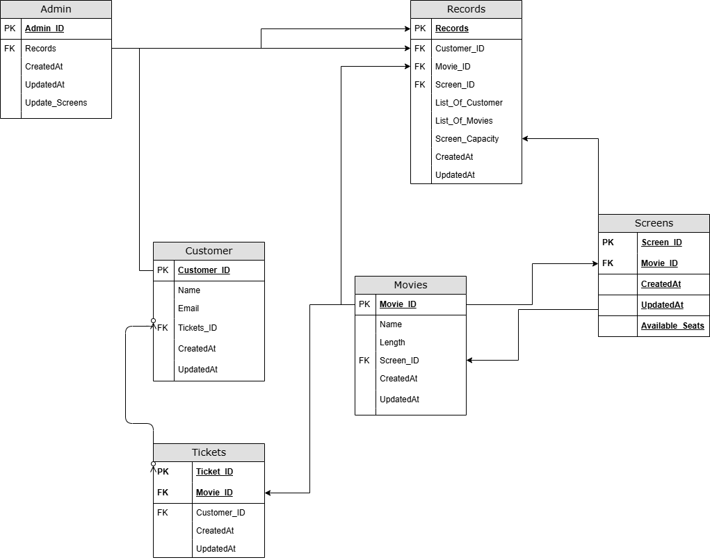

# Database Design

## Learning Objectives
- Identify user stories from an epic
- Design the logical structure of a database with an Entity Relationship Diagram

## Epic

A local cinema wants to allow people to book tickets online to see movies that are being shown in its various screens. These tickets should be delivered to customers via email. The cinema wants to keep a record of their customers and the tickets they purchase, as well as offer a regularly updated list of movies for them to choose from. A single screen might show multiple movies a day, and even the same movie at multiple times. The cinema will expand its number of screens in the future, so the potential for growth needs to be accounted for.

## Instructions
1. Using the epic above, extract as many user stories as you can identify. Some have already been done for you below these instructions.

2. From those user stories, extract the domain entities that will be required to design the database for this cinema.

3. Create an Entity Relationship Diagram based on these domain entities. To begin with, focus on the individual entities and disregard any relationships.

4. Every entity needs to have, as a minimum, the following attributes:
    - `id`, which is an auto-incrementing integer Primary Key
    - `createdAt`, which is a DateTime
    - `updatedAt`, which is a DateTime

5. Consider the potential relationships between each entity and implement them into your diagram

## Requirements
- You should have *at least* 6 entities in your finished diagram
- Each entity should have *at least* the minimum required attributes
- Each entity should have the appropriate relations

## Delivery

1. Fork this repository and clone the fork to your machine.
2. Add your user stories to [user-stories.md](./user-stories.md).
2. Add a picture of your diagram. You can use whichever tool you like, here are some examples:
    1. [Miro](https://miro.com/) with the Entity Relationship Diagram template
    2. [Whimsical](https://whimsical.com/) with the Flow Chart template and table shapes provided in that template
    3. [diagrams.net (formerly draw.io)](https://app.diagrams.net/)
    4. [lucidchart.com](https://www.lucidchart.com/)
    5. [gleek.io](https://gleek.io/) which uses a more code-like approach to building diagrams
    6. Pen and paper

# Examples

## Extracting user stories from the epic

Let's consider the first two sentences from the point of view of a customer:

*"A local cinema wants to allow people to book tickets online to see movies that are being shown in its various screens. These tickets should be delivered to customers via email."*

We know that a customer needs to be able to book tickets online, and we know that the delivery method is via email. Using this information, we can put ourselves into the shoes of a customer and construct a short user story:

*"As a customer, so I can receive my tickets, I want to provide my contact information."*

This has broken down a big block of text (the business case, or "epic" as it's often called) into a single piece of information that we can use. Now that we have a short, single-purpose user story, we can begin to imagine what entities we might need to represent this in a database.

## Extracting entities from a user story

Let's use that user story we extracted above:

*"As a customer, so I can receive my tickets, I want to provide my contact information."*

At first glance, there are two obvious candidates for entities: *Customers* and *Tickets*. This is enough information for us to start creating our diagram - we don't need to worry about relationships at this point.

Let’s then consider a scenario where a customer is booking a ticket as a gift for her husband; she wants the ticket to be in his name, but wants to provide her own contact information so she can surprise him. Does it make sense that the Customer should have a name of "John Smith" but the email address on that entity refers to "jane.smith@gmail.com"?

With this, we can see a third entity has made itself visible: *Contact*. From this one user story, we've extracted three entities!

## Some user stories

- *"As a customer, so I can receive my tickets, I want to provide my contact information."*
- *"As a customer, so I can decide which movie I want to watch, I want to see a list of movies."*
- *"As an admin, so I can manage the movies shown at the cinema, I want to update the list of movies."*
- *"As a customer, so I can keep track of my ticket, I want to receive a ticket via email."*
- *"As an admin, so I can keep track of my customers, I want to get a customer record, and a ticket record."*
- *"As an admin, so I can update my customers with available movies, I want to keep a list of all available movies to choose from."*
- *"As a customer, so I can choose my preffered screening room, I want to see which screens that shows my desired movie."*
- *"As an admin, so I can expand the amount of screens, I want to be able to update the amount of screens available."*

## Entity Diagram

